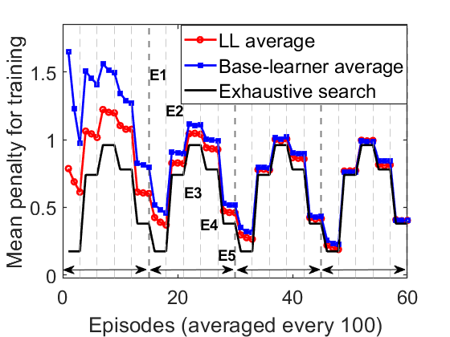

# Lifelong Swarm Metaverse

MATLAB simulation code for the paper

> **Semantic-Aware Architecture Design for a Lifelong Swarm Metaverse**
> Ning Wang, Yinxuan Wu, Beatriz Lorenzo, Bing Liu
> *IEEE Internet of Things Journal* — [IEEE Xplore](https://ieeexplore.ieee.org/document/10807275/)

A UAV swarm serves a dynamic Metaverse. A **central collection UAV** collects tasks from several
semantic environments, and **UAV edge servers** compute them. The environments differ in task
arrival rate, number of tasks, throughput and latency requirements. The repository implements the
three algorithms of the paper and their integration:

| Sub-problem | Algorithm | Main code |
|---|---|---|
| Mobility of the UAV servers (P1) | **PSO-CEMA**: PSO-based collection-edge mobility (Alg. 1) | [`online/mobility/PSO_update_location.m`](online/mobility/PSO_update_location.m) |
| Task allocation collection UAV → servers (P2) | **LDF-DPTAA**: dual queues, Lyapunov drift and dynamic programming (Alg. 2) | [`online/allocation/lyapunov_task_allocation.m`](online/allocation/lyapunov_task_allocation.m) |
| Computing resource allocation on each server (P3) | **LL-CJTPA**: lifelong learning (PG-ELLA) with an NAC base learner (Alg. 3) | [`training/`](training/) + [`online/learning/updatePGELLA.m`](online/learning/updatePGELLA.m) |
| Joint system | **PSO-LDF-LL** (Alg. 4) | [`online/run_online_lifelong.m`](online/run_online_lifelong.m) |

<p align="center">
  <br>
  <em>Fig. 8(a): when the semantic environment changes (every 300 episodes), the lifelong learner
  reaches the exhaustive-search optimum much faster than the NAC base learner.</em>
</p>

## Repository structure

```
lifelong-swarm-metaverse/
├── setup_paths.m            # put ONE module on the MATLAB path (see "Two modules" below)
├── common/                  # repo_root, output_dir, solve_lasso (SPAMS wrapper)
├── training/                # Phase 1 – central collection UAV (Sec. IV-C.1, Fig. 8)
│   ├── run_training_base_learner.m      # NAC base learner  -> policy_base.mat
│   ├── run_training_lifelong.m          # PG-ELLA lifelong learner -> modelsPGELLA.mat, Fig. 8
│   ├── run_training_exhaustive_search.m # optimum reference curve of Fig. 8(a)
│   ├── plot_training_results.m
│   ├── environment/   task & queue generation, MDP description
│   ├── mdp/           rollout, action sampling, queue update, cost (Eq. 21)
│   └── learning/      ENAC, Hessians, PG-ELLA init/update, pre-training
├── online/                  # Phase 2 – UAV swarm with PSO-LDF-LL (Figs. 3–7, 9–13)
│   ├── run_online_base_learner.m        # PSO-CEMA + LDF-DPTAA + NAC  (then runs LL)
│   ├── run_online_lifelong.m            # PSO-CEMA + LDF-DPTAA + LL   (saves results)
│   ├── run_online_*_no_mobility.m       # ablation: no mobility optimisation
│   ├── run_online_*_fair_alloc.m        # baseline: equal-split task allocation
│   ├── run_online_random_policy.m       # baseline: random computing policy
│   ├── sweep_zeta.m                     # sweep of the buffer margin ζ (Fig. 13)
│   ├── compare_online_results*.m        # per-environment comparison plots (Figs. 9–12)
│   ├── mobility/      PSO-CEMA, A2A rate model, required distance, UAV path
│   ├── allocation/    LDF-DPTAA, drift-plus-penalty reward, queues
│   ├── environment/   UAV servers and semantic task generation (Table II)
│   ├── mdp/  learning/  same roles as in training/
│   └── tools/         rate/slope-vs-distance plots
├── plotting/                # paper figures from saved results (Figs. 7, 13)
├── data/
│   ├── pretrained/          # policy_base.mat, modelsPGELLA.mat (output of training/)
│   └── results/             # result files behind the paper figures (see data/README.md)
└── docs/
    └── paper_to_code.md     # equation / algorithm / figure -> file map
```

## Requirements

- MATLAB (developed with R2023a)
- Parallel Computing Toolbox (`parpool`, `parfor`)
- Statistics and Machine Learning Toolbox (`normrnd`, `mvnrnd`; `lasso` for the fallback below)
- Communications Toolbox (`randsrc`, training module only)
- **SPAMS** toolbox for the sparse-coding step of PG-ELLA (`mexLasso`). It is not bundled
  because it is GPL-licensed and platform-specific. Download it from the
  [SPAMS website](https://thoth.inrialpes.fr/people/mairal/spams/), then build or use the
  pre-compiled binaries and pass its folder to `setup_paths`. Without SPAMS, `solve_lasso`
  falls back to MATLAB's `lasso` with an equivalent objective, so the results can differ slightly
  from the published ones.

## Quick start

All commands are run from the repository root in MATLAB.

### 1. Plot the paper figures from the shipped results (no simulation)

```matlab
setup_paths('online');
plot_task_allocation_mobility   % impact of the mobility model on task allocation (Fig. 7)
plot_zeta_allocation_reward     % task-allocation reward vs. zeta (Fig. 13a)
plot_zeta_penalty_per_env       % computing penalty vs. zeta per environment (Fig. 13b-c)
```

### 2. Training phase in the central collection UAV (Fig. 8)

```matlab
setup_paths('training', 'C:\path\to\spams-matlab-v2.6');
run_training_base_learner   % trains NAC, then runs run_training_lifelong and plots Fig. 8
```

The new `policy_base.mat` and `modelsPGELLA.mat` are written to `outputs/pretrained/`. To use
them in the online phase, copy them to `data/pretrained/` or keep them in the workspace.

### 3. Online UAV-swarm simulation (Figs. 3–7, 9–12)

```matlab
setup_paths('online', 'C:\path\to\spams-matlab-v2.6');
run_online_base_learner     % PSO-CEMA + LDF-DPTAA + NAC, then the same with LL
compare_online_results      % penalty / lifespan / energy / queue length per environment
```

Results are written to `outputs/results/`. Ablations and baselines:
`run_online_base_learner_no_mobility`, `run_online_base_learner_fair_alloc`,
`run_online_random_policy`.

### 4. Sweep of the buffer margin ζ (Fig. 13)

```matlab
sweep_zeta                  % one full online simulation per zeta value (slow)
```

## Two modules, one MATLAB path

`training/` and `online/` were developed as two separate simulators. They share several function
names (`Trajectory_process`, `task_generation`, `Task_description`, …) whose signatures differ:
training simulates isolated server queues, while online simulates the full swarm. Always switch
modules with `setup_paths('training')` or `setup_paths('online')`, which removes the other module
from the path.

The experiment scripts are MATLAB *scripts* that share state through the base workspace. For
example, `run_online_base_learner` ends with `run('run_online_lifelong.m')`, and the LL script
saves the base-learner results of the first one. Run them in the order given above.

## Key simulation parameters

| Parameter | Value | Where |
|---|---|---|
| Map / collection-UAV speed / server max speed | 1 km × 1 km / 10 m/s / 20 m/s | `online/run_online_*.m`, `online/environment/server_generation.m` |
| UAV servers / types | 25 / 5 | `online/run_online_*.m` |
| Hovering positions N_e / time steps per position T | 100 / 50 | `online/run_online_*.m` |
| Buffer margin ζ | 5 | `online/run_online_*.m` |
| PSO: particles / iterations / w / w_damp / c1, c2 | 50 / 100 / 1 / 0.98 / 1.5 | `online/mobility/PSO_update_location.m` |
| Lyapunov trade-off V | 5000 | `online/allocation/getreward.m` |
| Training episodes / environment switch | 6000 / every 300 | `training/run_training_*.m` |
| Learning rate base learner / LL | 0.002 / 0.003 | `training/run_training_lifelong.m`, `training/learning/pretraining.m` |
| Per-environment B, P, m, λ, η, Δ | Table II of the paper | `online/environment/*.m`, `training/environment/*.m` |

## Citation

If you use this code, please cite:

```bibtex
@article{wang2025semantic,
  author  = {Wang, Ning and Wu, Yinxuan and Lorenzo, Beatriz and Liu, Bing},
  title   = {Semantic-Aware Architecture Design for a Lifelong Swarm Metaverse},
  journal = {IEEE Internet of Things Journal},
  year    = {2025},
  url     = {https://ieeexplore.ieee.org/document/10807275/}
}
```

## Acknowledgements

This work was partially supported by the US National Science Foundation under Grant
CNS-2225427. The lifelong-learning component follows PG-ELLA (Ammar et al., ICML 2014) and ELLA
(Ruvolo & Eaton, ICML 2013). The base learner is episodic Natural Actor-Critic (Peters & Schaal,
2008).

## License

Released under the [MIT License](LICENSE). The SPAMS toolbox is a separate dependency under its
own license.
